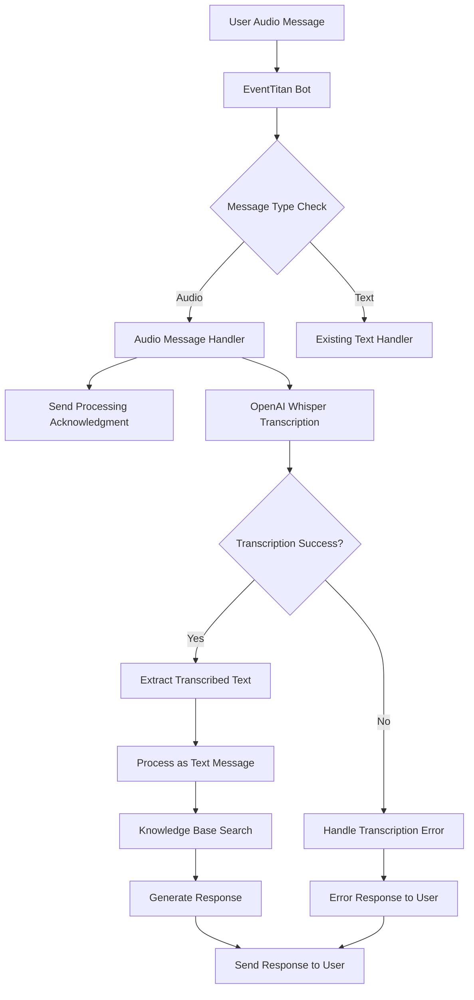
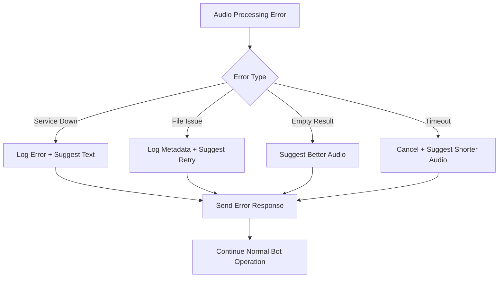

# Design Document

## Overview

This design document outlines the integration of speech-to-text functionality into the EventTitan bot using OpenAI's Whisper model. The solution will extend the existing message handling system to detect audio messages, transcribe them to text, and process the transcribed content through the bot's existing knowledge base and response logic. The design maintains backward compatibility while adding seamless voice interaction capabilities.

## Architecture

### High-Level Architecture



### Integration Architecture

The speech-to-text integration will be implemented as an extension to the existing EventTitan bot architecture:

1. **Bot Definition Layer**: Add OpenAI integration with speech-to-text capabilities
2. **Message Handler Layer**: Extend current message routing to handle audio messages
3. **Transcription Service Layer**: New service for audio-to-text conversion
4. **Processing Layer**: Route transcribed text through existing knowledge base logic

## Components and Interfaces

### 1. Bot Definition Updates

**File**: `bots/eventtitan/bot.definition.ts`

The bot definition will be updated to:
- Ensure OpenAI integration includes speech-to-text interface
- Add any necessary configuration for audio message handling

### 2. Audio Message Handler

**New Component**: `bots/eventtitan/src/audio-handler.ts`

```typescript
interface AudioHandlerOptions {
  fileUrl: string;
  conversationId: string;
  userId: string;
}

interface TranscriptionResult {
  success: boolean;
  text?: string;
  error?: string;
  cost?: number;
}

class AudioHandler {
  async transcribeAudio(options: AudioHandlerOptions): Promise<TranscriptionResult>
  async handleAudioMessage(message: AudioMessage, api: Api): Promise<void>
}
```

**Responsibilities**:
- Detect audio message types
- Send processing acknowledgment to users
- Call OpenAI transcription service
- Handle transcription errors
- Route successful transcriptions to text processing

### 3. Enhanced Message Router

**Updated Component**: `bots/eventtitan/src/index.ts`

The main message handler will be extended to:
- Route audio messages to the new AudioHandler
- Maintain existing text message processing
- Provide unified error handling

### 4. Transcription Service Integration

**Integration Point**: OpenAI Whisper via existing integration

The service will:
- Use the existing OpenAI integration's `transcribeAudio` action
- Handle authentication and API communication
- Manage transcription costs and logging
- Provide error handling for service failures

## Data Models

### Audio Message Structure

```typescript
interface AudioMessage {
  type: 'audio';
  payload: {
    audioUrl: string;
    userId?: string;
  };
  conversationId: string;
  // ... other message properties
}
```

### Transcription Response

```typescript
interface TranscriptionResponse {
  text: string;
  language?: string;
  duration?: number;
  botpress: {
    cost: number;
  };
}
```

### Processing State

```typescript
interface AudioProcessingState {
  messageId: string;
  status: 'processing' | 'completed' | 'failed';
  transcriptionText?: string;
  error?: string;
  startTime: Date;
  endTime?: Date;
}
```

## Error Handling

### Error Categories and Responses

1. **Transcription Service Unavailable**
   - Response: "🎤 Sorry, I'm having trouble processing audio right now. Please try typing your message instead."
   - Action: Log error, suggest text alternative

2. **Audio File Issues**
   - Response: "🎤 I couldn't process your audio file. Please try recording again or type your message."
   - Action: Log file metadata, suggest retry

3. **Empty Transcription**
   - Response: "🎤 I couldn't hear anything in your message. Could you try speaking more clearly or typing instead?"
   - Action: Suggest retry with better audio quality

4. **Transcription Timeout**
   - Response: "🎤 Your audio is taking longer to process than expected. Please try a shorter message or type instead."
   - Action: Cancel processing, suggest alternatives

### Error Recovery Strategy



## Testing Strategy

### Unit Tests

1. **Audio Handler Tests**
   - Test transcription success scenarios
   - Test various error conditions
   - Test cost tracking and logging
   - Mock OpenAI service responses

2. **Message Router Tests**
   - Test audio message detection
   - Test routing to audio handler
   - Test fallback to text processing
   - Test error propagation

3. **Integration Tests**
   - Test end-to-end audio processing
   - Test knowledge base integration with transcribed text
   - Test error handling flows
   - Test response generation

### Test Data Requirements

1. **Sample Audio Files**
   - Clear speech samples
   - Noisy audio samples
   - Empty/silent audio files
   - Various audio formats and durations

2. **Mock Responses**
   - Successful transcription responses
   - Error responses from OpenAI
   - Timeout scenarios
   - Cost calculation scenarios

### Testing Approach

```typescript
// Example test structure
describe('AudioHandler', () => {
  describe('transcribeAudio', () => {
    it('should successfully transcribe clear audio')
    it('should handle transcription service errors')
    it('should handle empty audio files')
    it('should track transcription costs')
  })
  
  describe('handleAudioMessage', () => {
    it('should send processing acknowledgment')
    it('should process transcribed text through knowledge base')
    it('should handle transcription failures gracefully')
  })
})
```

## Implementation Considerations

### Performance Optimization

1. **Async Processing**: Audio transcription will be handled asynchronously to avoid blocking other bot operations
2. **Timeout Management**: Implement reasonable timeouts for transcription requests
3. **Cost Monitoring**: Track and log transcription costs for budget management

### Security Considerations

1. **Audio File Validation**: Validate audio file formats and sizes before processing
2. **API Key Management**: Ensure secure handling of OpenAI API credentials
3. **User Privacy**: Handle audio data according to privacy requirements

### Scalability Considerations

1. **Rate Limiting**: Implement appropriate rate limiting for transcription requests
2. **Error Resilience**: Design for graceful degradation when transcription services are unavailable
3. **Monitoring**: Add logging and metrics for transcription success rates and performance

### Integration Points

1. **Existing Knowledge Base**: Transcribed text will seamlessly integrate with the current `searchKnowledge()` function
2. **Response Generation**: Transcribed queries will use existing response logic in the message handler
3. **API Layer**: Utilize the existing `Api` class for sending responses and managing conversations

## Deployment Strategy

### Rollout Plan

1. **Phase 1**: Implement core transcription functionality with basic error handling
2. **Phase 2**: Add comprehensive error handling and user feedback
3. **Phase 3**: Optimize performance and add advanced features
4. **Phase 4**: Monitor usage and costs, adjust as needed

### Configuration Requirements

1. **OpenAI Integration**: Ensure OpenAI integration is properly configured with speech-to-text capabilities
2. **Audio File Handling**: Configure appropriate file size limits and supported formats
3. **Cost Monitoring**: Set up cost tracking and alerting for transcription usage

This design provides a robust foundation for adding speech-to-text capabilities to EventTitan while maintaining the existing functionality and user experience.