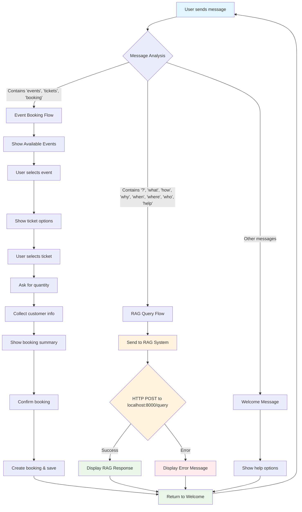

# Eventello Bot + RAG Integration Flow



## 🔄 Conversation States

### Welcome State (`welcome`)
- **Purpose**: Detect user intent and route accordingly
- **Triggers**: Any message
- **Actions**: 
  - Route to event booking if keywords detected
  - Route to RAG query if question detected
  - Show general help if neither detected

### Event Booking States
- **`event-selection`**: User chooses from available events
- **`ticket-selection`**: User selects ticket type
- **`quantity-selection`**: User specifies number of tickets
- **`personal-details`**: User provides contact information
- **`confirmation`**: Final booking confirmation

### RAG Query State (`rag-query`)
- **Purpose**: Process knowledge-based questions
- **Triggers**: Questions, help requests, knowledge queries
- **Actions**:
  - Send HTTP POST to RAG system
  - Display response or error
  - Return to welcome state

## 🎯 Smart Routing Logic

The bot automatically detects user intent:

```typescript
// Event booking keywords
if (userMessage.includes('event') || userMessage === 'events' || 
    userMessage.includes('ticket') || userMessage.includes('booking')) {
    // Route to event booking flow
}

// Question keywords
else if (userMessage.includes('?') || userMessage.includes('what') || 
         userMessage.includes('how') || userMessage.includes('why') || 
         userMessage.includes('when') || userMessage.includes('where') || 
         userMessage.includes('who') || userMessage.includes('help')) {
    // Route to RAG query flow
}
```

## 🔌 HTTP Integration Points

### RAG System Communication
- **Endpoint**: `http://localhost:8000/query`
- **Method**: POST
- **Headers**: `Content-Type: application/json`
- **Body**: `{ "query": "user question" }`
- **Response**: `{ "response": "answer", "success": true }`

### Error Handling
- **Connection refused**: RAG system down
- **Timeout**: RAG system slow
- **Invalid response**: Format mismatch
- **Network errors**: General connectivity issues

## 📱 User Experience Flow

1. **User types question** → Bot detects intent
2. **Bot shows processing message** → "I'll help you with that question..."
3. **Bot queries RAG system** → HTTP request to localhost:8000
4. **Bot displays response** → Formatted RAG answer
5. **Bot offers next steps** → "Ask another question or book events"
6. **Return to welcome** → Ready for next interaction

## 🚀 Benefits of This Integration

- **Seamless Experience**: Users don't need to know about RAG vs. events
- **Smart Routing**: Automatic intent detection
- **Fallback Handling**: Graceful error handling
- **Flexible**: Easy to modify question detection logic
- **Scalable**: Can add more conversation flows easily
